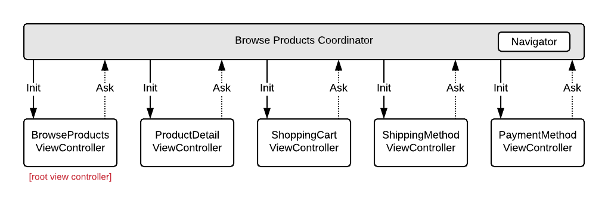
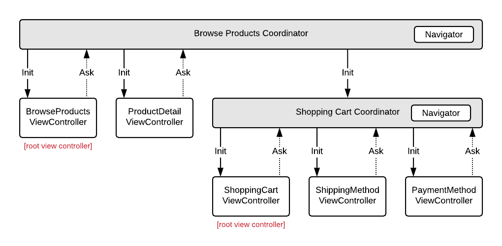

# Coordinator
An iOS navigation coordinator written in Swift 5.

## About
There are a lot of implementations floating around the iOS community of using Coordinators to remove the burden of navigation from `UIViewController`s. The Coordinator pattern is so broad, however, that there a lot of different interpretions of how to implement it.

This is my own take on the Coordinator pattern.

## Purpose
In my opinion, a Coordinator serves three main purposes:

1. Handle the preparation, navigation between, and presentation of at least one - but often many - view controllers.
2. Liase between different services, like a Networking Service, in order to pull business logic out of our view controllers.
3. Optionally manage child Coordinators, in order to divy up responsibilities of complex navigation routes.

## How To Use

### Coordinator
The coordinator sits above your view controllers and directs the flow of traffic via delegates. 

For instance, say you had a view controller for browsing products to buy and wanted to tap into a product's detail, it would usually look something like this:

```swift
final class BrowseProductsViewController: UIViewController {
    
    func onProductTapped(product: Product) {
        let productDetailViewController = ProductDetailViewController(product: product)          
        navigationController?.pushViewController(productDetailViewController, animated: true)    
    }
    
}

```

With a `Coordinator`, it would be broken up something like this:

```swift
// The delegate we'll use to talk to the Coordinator

protocol BrowseProductsViewControllerDelegate: class {
    func browseProductsViewController(_ controller: BrowseProductsViewController, didTapProduct product: Product)
}

// Our revised view controller, now using the delegate

final class BrowseProductsViewController: UIViewController {
    
    weak var delegate: BrowseProductsViewControllerDelegate?
    
    func onProductTapped(product: Product) {
        delegate?.browseProductsViewController(_ controller: self, didTapProduct product: product)
    }
    
}

// The view controller's owning coordinator

final class BrowseProductsCoordinator: NavigationCoordinator { 

    // Any child coordinators this Coordinator is holding on to
    var childCoordinators: [Coordinator] = []
    
    // Our custom UINavigationController wrapper
    var navigator: NavigatorType
    
    // The view controller this Coordinator is managing
    var rootViewController: BrowseProductsViewController
    
    init(navigator: NavigatorType) {
        self.navigator = navigator
        self.rootViewController = BrowseProductsViewController()
    }
    
    func start() {
        rootViewController.delegate = self 
    }

}

// With delegate conformance 

extension BrowseProductsCoordinator: BrowseProductsViewControllerDelegate {

    func browseProductsViewController(_ controller: BrowseProductsViewController, didTapProduct product: Product) {
        let productDetailViewController = ProductDetailViewController(product: product)  
        
        // In a more complex situation, here's where the Coordinator could reference services,
        // like fetching information from the network or the local data store,
        // to prepare the view controller for presentation.
        
        navigator.push(productDetailViewController, animated: true)
    }

}

```

In the refactored code using a `Coordinator`, we've taken away the view controller's knowledge of where it's been and where it's going. This ostensibly makes our view controller just a view, making it incredibly reusable, and pulls out routing and business logic to be handled by something else.

### Navigator
The `Navigator` is a wrapper / proxy for a `UINavigationController`, providing methods for the coordinator to push and pop view controllers on the navigation stack. 

The reason for using `Navigator` rather than a regular `UINavigationController` is that it conforms to `UINavigationControllerDelegate`, providing a callback when a controller is popped from the stack (like when a user swipes-to-go-back on a screen). These callbacks allow the `Coordinator` to remove any child coordinators if needed, deallocating them from memory.

### Coordinators can be used how you want


A single Coordinator could be used to route to multiple view controllers in a flattened hierarchy:


But it could also have one, or many, child coordinators which is responsible for a specific chunk of navigation:


It's a very flexible pattern, so use it how you determine best!

## Example Project
In this repo you'll see an example project of how someone might use the Coordinator pattern in an actual app.

In many examples I've found online, the pattern itself is often combined with ViewModels and/or using Reactive binding ("MVVM-C"). While these approaches can be helpful in solving certain problems, the Coordinator pattern itself can be used - and maybe better understood - without these added abstractions.

With that, my example project focuses exclusively on the relationship between Coordinators and ViewControllers, in an intentional effort to avoid the confusion of mixing together multiple patterns.

To see the example app, simply open `Example/Coordinator-Example.xcodeproj` in Xcode and run the project.

## Credits
Thanks for checking out my take on coordinators -- I hope it's helpful if you're exploring the pattern to use in a project. if you have any suggestions or improvements, feel free to submit a PR! 

I borrowed from a lot of examples around the community and want to thank / credit the following for inspiration and ideas:

[Soroush Khanlou: Presenting Coordinators](https://vimeo.com/144116310)  
[Ian MacCallum: Coordinators, Routers, and Back Buttons](https://hackernoon.com/coordinators-routers-and-back-buttons-c58b021b32a)  
[Paul Hudson: How to use the coordinator pattern in iOS apps
](https://www.hackingwithswift.com/articles/71/how-to-use-the-coordinator-pattern-in-ios-apps)